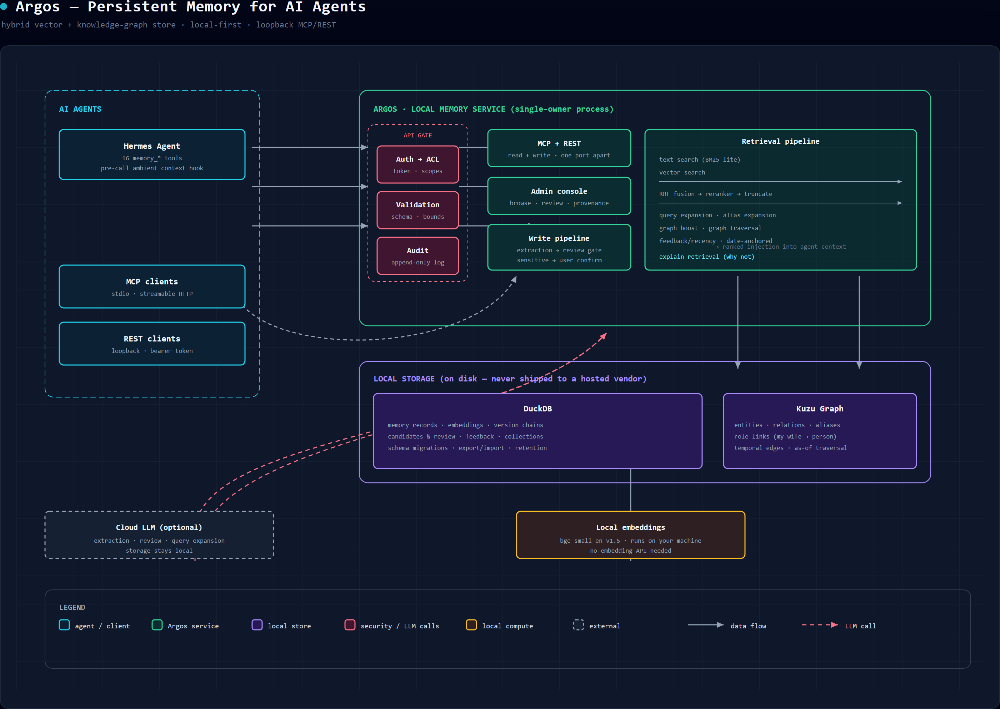

# Argos


Persistent memory for AI agents, on your own machine. A Hermes plugin with a standalone server: hybrid vector + graph store, local embeddings, and an external API (MCP + REST).

## Capabilities

- **Facts persist across sessions.** Tell it once, ask weeks later.
- **Changes are versioned, not erased.** Updating a fact chains a new version onto the old one. Ask "what changed?" and get the history.
- **Semantic search.** Vector + keyword fusion (RRF), optional GPU reranker (BAAI/bge-reranker-base, similarity + cross-encoder blend), date-anchored temporal handling, and a change-intent chain-unfold pass.
- **Relationship graph.** A Kùzu graph of entities, relations, and aliases backs entity-aware retrieval boosts. Multi-hop graph traversal is **unproven**: the 2026-09-02 A/B (#139) only exercised a regex-built graph on which traversal never engaged, so its "flat" result is not evidence either way (#364; see CLAIMS-AUDIT §4). Traversal is disabled in the live config; alias expansion is the graph's only live retrieval contribution.
- **Ambient context.** Time, location, weather, and recent file activity inject every turn via a `pre_llm_call` hook.
- **Insight capture.** "I just realised…" moments are logged verbatim. Browse with `/ilog`, resurface with `/revisit`, store exclusions with `/neg <claim>`.
- **Gated distillation.** Once a day, cost-capped, Argos proposes distilled patterns from accumulated records. Nothing lands in memory without your approval.
- **External API.** A read tier over MCP (stdio) and REST (HTTP) — any MCP-capable agent or script can search, fetch, and inspect histories against the same store, behind a canonical auth → ACL → validation → audit facade. See [External API](#external-api).
- **Multitenant cells.** Per-tenant stores behind the shared service: provisioning, isolation, and concurrency gates (end-to-end tested).
- **Temporal as-of queries.** Records carry `valid_from` / `valid_to` / `superseded_by`; retrieval defaults to the current view and supports `as_of` and `include_closed`. Chronological injection (oldest-first on temporal turns) is implemented, off by default.
- **Reversible cleanup.** Maintenance and consolidation quarantine stale or duplicate memories, not delete them. Explicit deletion (`memory_delete`) is chain-aware: multi-version records promote the predecessor or quarantine the middle version; single-version records are hard-deleted and tombstoned against re-creation.

## Architecture



Agents reach Argos over loopback-only MCP/REST behind a canonical auth → ACL → validation → audit gate. Writes flow through an extraction → review pipeline (sensitive facts wait for explicit user confirmation); reads run the hybrid retrieval pipeline (text + vector search fused with RRF, then expansion, graph boost, and recency/date-anchor passes) and return ranked, provenance-carrying records. Everything persists locally in DuckDB (records, embeddings, version chains) plus a Kuzu knowledge graph; embeddings run on your machine, while optional LLM-assisted steps (extraction, review, query expansion) call your configured cloud model.

## Trust model

Nothing becomes a memory silently. Every turn is mined for facts (regex first, LLM fallback), but the output is a *proposal* — pending until you approve it. `memory_save` is the explicit exception: it writes directly to active memory, an intentional agent action rather than passive ingestion. Updates chain versions instead of overwriting. Cleanup quarantines instead of deleting; explicit `memory_delete` on a single-version record hard-deletes and tombstones it (re-creation is blocked until the tombstone is purged). Distillation proposes but never writes. Provenance and grounding are tracked per record (write-time trust taint, quote verification). Every capability listed above is measured by the eval harness or structurally verified against source — see [Verification](#verification).

## External API

The API is a **read + write tier** (spec-09/10: transports are trust boundaries, not thin wrappers). Both servers bind to loopback only and enforce a bearer token; the operation set is an explicit allowlist behind `ArgosAPIFacade` (auth-context → ACL → validation → audit). No raw RPC passthrough — internal operations (shutdown, backup, set_state, purge, and friends) are never exposed.

**ACL enforcement is opt-in.** The default servers run in trusted-local mode (`api_mode=False`, loopback + bearer token + operation allowlist only); the per-record access-scoping layer engages when started with `api_mode=True` and a configured ACL.

**Write classes** (spec-10):
- **Class A (propose):** external callers submit a candidate for human review. Nothing becomes active memory until a human approves it.
- **Class B (review):** human principals approve/reject candidates. Model principals are denied — no self-approval, ever.
- **Class C (direct write):** loopback-only trusted-local writes (`memory_save`, `memory_update`, collection writes). Same provider-level semantics as the native path (graph indexing, version chaining).

- **MCP (stdio):** `argos_plugin/mcp_server.py` — JSON-RPC 2.0 over stdio. Read: `memory_search`, `memory_fetch`, `memory_fetch_history`, `memory_explain`, `memory_why_not`, `memory_capabilities`, `collection_list`, `collection_items`. Write (loopback): `memory_save`, `memory_update`, `collection_create`, `collection_add_item`, `collection_update_item`, `collection_remove_item`. Review: `memory_candidate_review` (human only). Propose: `memory_propose`. Register with any MCP client.
- **REST (HTTP):** `argos_plugin/rest_server.py` — bound to `127.0.0.1` only; token from `ARGOS_REST_TOKEN` (or `rest_token` in the Hermes home config); origin and content-length checks.
  - Read: `GET /v1/health`, `GET /v1/ready`, `GET /v1/capabilities`, `POST /v1/memory/search`, `POST /v1/memory/explain-retrieval`, `GET /v1/memories/{memory_id}`, `GET /v1/memories/{memory_id}/history`, `GET /v1/memories/{memory_id}/explain`, `GET /v1/candidates`, `GET /v1/collections`, `GET /v1/collections/{collection_id}/items`.
  - Write (loopback): `POST /v1/memories` (class C direct write on loopback; class A propose on non-loopback), `POST /v1/collections`, `POST /v1/collections/{collection_id}/items`, `PATCH /v1/collections/{collection_id}/items/{item_id}`, `DELETE /v1/collections/{collection_id}/items/{item_id}`.
  - Review: `POST /v1/candidates/{candidate_id}/decision` (human only).
  - Feedback: `POST /v1/memories/{memory_id}/feedback`.
  - `Idempotency-Key` header required on all POSTs/PATCHes/DELETEs. CAS via `If-Match` header on PATCH/DELETE → 409 on conflict.

```bash
# REST (read + write on loopback)
ARGOS_REST_TOKEN=<token> ARGOS_API_CAN_WRITE=1 \
  python -m argos_plugin.rest_server --home <hermes-home> --port 8732
# MCP (read + write on loopback)
ARGOS_API_CAN_WRITE=1 python -m argos_plugin.mcp_server --home <hermes-home>
```

**Collections** (spec-10 PR-2/3): exhaustive, structural stores (backlogs, reading lists). No ranking, no similarity — all items returned. Scope-isolated per tenant/user. Collection writes are class C (loopback only) and gated by a server-verified HMAC capability (boot-time `gate_secret`); a raw RPC caller without the secret cannot forge the proof.

**Security model** (spec-10):
- `principal_type` ("human" | "model") is wired by the transport — a model principal is denied class B (no self-approval). The default is "model" (fail-closed): a transport that forgets to set `ARGOS_API_PRINCIPAL_TYPE` is treated as a model agent and cannot approve candidates. A human-driven UI must explicitly set `ARGOS_API_PRINCIPAL_TYPE=human` to unlock class B.
- `is_loopback` is set by the transport — class C writes require loopback + server-derived identity.
- Client-supplied `user_id`/`tenant`/`scope` are rejected or narrowed, never widened.
- Collection writes and `facade_delete_memory` require a server-verified HMAC (`call_gated` → `_gate_hmac`); the service verifies before honoring `_confirmed`.

## Admin Console (#295)

A local web UI for browsing, searching, reviewing candidates, and triggering ops (erase/export) — all through the same `ArgosAPIFacade` (auth → ACL → validation → audit). Loopback-only, same bearer token as the REST server.

```bash
# One-command start (same token as REST, one port above):
ARGOS_REST_TOKEN=<token> ARGOS_API_CAN_PROPOSE=1 \
  python -m argos_plugin.admin_console --home <hermes-home> --port 8733
```

Then open `http://127.0.0.1:8733` in your browser.

- **Browse** — list memories by category/namespace, scoped to your user/tenant.
- **Search** — full-text + semantic search through the facade.
- **Provenance** — evidence chain, version chain, conflict notes per record (#280 walk).
- **Review queue** — approve/reject pending candidates through the existing approval-ledger flow (no bypass; `review_source="tool"`, audit row written).
- **Erase** — POPIA erase-request with preview-first and strict confirm (#293).
- **Export** — portable JSONL + Markdown export (#294).

Security: bound to `127.0.0.1` only (never `0.0.0.0`); server-derived identity (no client-supplied user identity); read-only by default (set `ARGOS_API_CAN_PROPOSE=1` to enable mutation actions); `Cache-Control: no-store` on all responses; no tokens in HTML output.

## Tools

Sixteen `memory_*` tools, grouped:

| Group | Tools |
|-------|-------|
| Store & search | `memory_search`, `memory_save`, `memory_fetch_full` |
| Version chains | `memory_update`, `memory_delete`, `memory_chain` |
| Graph | `memory_graph_search`, `memory_graph_query` |
| Review & restore | `memory_candidate_list`, `memory_candidate_review`, `memory_restore` |
| Feedback & maintenance | `memory_feedback`, `memory_maintenance` |
| Diagnostics | `memory_why_not`, `memory_tombstones`, `memory_tombstone_purge` |

The MCP/REST surface exposes the read subset of these through the facade.

## Numbers

| Metric | Result | Protocol |
|--------|--------|----------|
| LongMemEval_S (best config) | 89.8% (449/500) | GLM-5.3-flash answerer, gpt-4o judge |
| LongMemEval_S (baseline) | 70.4% (352/500) | gpt-4o judge, default answerer |
| Chain-unfold (change-intent) | 93% recall / 93% precision | canonical eval harness |
| Temporal questions | 88.7% (118/133) | full-bank, text-leg hardening |
| Recall@96 | 99.6% | answer-bearing memories reaching top-96 |

Protocols, dataset SHA-256, per-category denominators, model versions, prompts, exact commands, and judged outputs: [eval/repro/BENCHMARK_REPRODUCIBILITY.md](eval/repro/BENCHMARK_REPRODUCIBILITY.md).

## Verification

Every number and capability statement above is backed by a committed, re-runnable artifact — nothing is quoted without evidence.

- **Independent review** — Argos is profiled in [agent-memory-atlas](https://neoneye.github.io/agent-memory-atlas/systems/argos/), a code-grounded catalog of agent-memory systems (reports pinned to a reviewed commit, capability marks backed by source evidence).
- **Claims audit** — [CLAIMS-AUDIT.md](CLAIMS-AUDIT.md) maps every claim to its evidence and separates three tiers: *measured* (committed judged artifacts), *structural* (checked against source), and *aspirational* (not claims yet). It is updated whenever a claim changes.
- **Reproducibility gate** — `./eval/repro/verify_repro.sh` re-verifies the committed judged artifacts + dataset SHA and fails on any drift (it re-counts committed result files; it does not re-run the pipelines behind them). Reproducing a number fully needs the committed judged artifacts **plus** the documented external run data: the sibling LongMemEval dataset checkout and the phase-A retrieval caches (see §1 → §8 of the reproducibility doc). Last gate run: **2026-09-03, all checks PASS**.
- **Test suite** — 2,915 test functions across 154 test modules (as of 2026-09-07), covering the store, retrieval, security gates, API facade, multitenancy, mutation_events audit log, and eval harness; runs hermetically on a fresh clone without a live Hermes runtime. The gate forces hermetic mode (`ARGOS_HERMETIC_TESTS=1` in the runner) so unmocked LLM-path tests can never make real calls, even in venvs that resolve the Hermes runtime. Run it in a visible, live-updating window (GPU venv + bounded parallel workers with the shared-service grouping, per #98): `powershell -File scripts/run_tests_visible.ps1`. Manual equivalent from `argos_plugin/`: `"%LOCALAPPDATA%/hermes/hermes-agent/venv-cuda/Scripts/python.exe" -m pytest tests/ -q -n 4 --dist loadgroup`.

Honest boundaries that travel with the claims:

- Benchmark numbers are self-measured on the maintainer's stack and answerer-conditional (the 89.8% headline uses a GLM-5.3-flash answerer with a gpt-4o judge); small-n bands are indicative.
- Some measurements are internal-only, not yet banked as committed artifacts — they are deliberately excluded from the public claim set.
- The plugin is developed and tested on the maintainer's build of Hermes. It uses only stock plugin APIs (memory provider, pre-call hook, user-context injection), but a stock upstream build hasn't been through the test suite yet.

## What it can't do

The external API binds to loopback only — reads and writes work locally (MCP + REST), but there is no remote network access from other machines. Memory data, embeddings, and graph live locally as flat files — no hosted vendor. LLM calls for extraction, review, and distillation go through your configured cloud model; no native local-LLM support yet. Embeddings run offline (CPU or CUDA); the optional reranker needs a GPU (or falls back to similarity-only).

## Quick start

1. Copy `argos_plugin/` to your Hermes plugins directory (`%LOCALAPPDATA%\hermes\plugins\hybrid_memory` on Windows).
2. Restart Hermes.
3. Run `hermes tools` — confirm the 16 `memory_*` tools appear.
4. Configure in `hybrid_memory.json` or the settings UI (Memory → Argos).
5. Optional: start the external API (see [External API](#external-api)) for non-Hermes agents.

Full walkthrough: [SETUP_GUIDE.md](SETUP_GUIDE.md). Compatibility boundary: see [Verification](#verification).

## License

Business Source License 1.1 (BSL 1.1): free for personal and non-production use; production or commercial use requires a license. Converts to Apache 2.0 on August 21, 2030. Full terms: [LICENSE.md](LICENSE.md).

## More docs

- [CONFIG_REFERENCE.md](CONFIG_REFERENCE.md) — every setting, default, and description
- [MEMORY_SYSTEM.md](MEMORY_SYSTEM.md) — how the system works under the hood
- [REINSTALL.md](REINSTALL.md) — reinstall, migration, graph rebuild